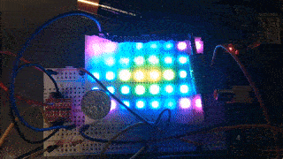

# Rainbow Emanator
The rainbow_emanator function generates a rust iterator for rendering a rainbow radial gradient emanating from the center of a grid (or strip).



## Backstory
This repository is actually inverted from how it began. I initially cloned [ws2818-rgb-led-spi-driver](https://github.com/phip1611/ws2818-rgb-led-spi-driver/), copied an example to use as a basis for displaying some rainbow patterns, moved the code to it's own crate, and split the LED display code from the RGB value generation into a [member crate](./examples/rpi_ws2812). I originally wanted to do more with my LED board, but then realized I'm just shoving pixels into a function, which made the project far less interesting.

## Potential TODOs
- Add other display examples, like a native window or HTML canvas via WASM.
- Understand and then collapse the dependencies (rewrite).
  - Get this to work as the sole program instead of leaning on Linux abstractions.

## Compiling the Raspberry Pi example
I tried to get cross compilation to Raspberry Pi working, but unfortunately if you don't use Ubuntu, support is half baked if it exists at all. Instead I decided to virtualize native compiling via the abomination below. Essentially you enter a Raspbian container (via systemd-nspawn or chroot) and have QEMU interpret individual executables rather than virtualize an entire system.

```bash
# Add support to binfmt subsystem for running binaries for other ISAs, such as
# ARMv5, without also running a whole VM.
docker run --rm --privileged multiarch/qemu-user-static --reset -p yes
# Setup loop devices for the image AND its partitions.
# Some guides make this harder than it should be...
sudo losetup -Pf ~/Downloads/2020-05-27-raspios-buster-lite-armhf.img
# Get the path to the created device file, just in case it isn't the expected path.
sudo losetup -j ~/Downloads/2020-05-27-raspios-buster-lite-armhf.img
# dir_index can cause a 32bit vs 64bit issue when using cargo.
# https://www.enricozini.org/blog/2019/himblick/ext4-and-32bit-arm-on-64bit-amd64/
sudo tune2fs -O^dir_index /dev/loop0p2
sudo mount /dev/loop0p2 /mnt
sudo mount --bind ~/public_html/rust /mnt/home/pi/rust
# Use chroot if you prefer.
sudo systemd-nspawn -D /mnt
# If your UID is 1000, this avoids ownership issues.
su pi
# Install Rust...
curl --proto '=https' --tlsv1.2 -sSf https://sh.rustup.rs | sh
# Add the correct target because QEMU supports arm7, but my Raspberry Pi is ARMv5.
rustup target add arm-unknown-linux-gnueabihf
# Make Rust use the correct target/ISA by default instead of the detected one.
cat >> ~/.cargo/config <<EOL
[build]
target = "arm-unknown-linux-gnueabihf"
EOL
```
